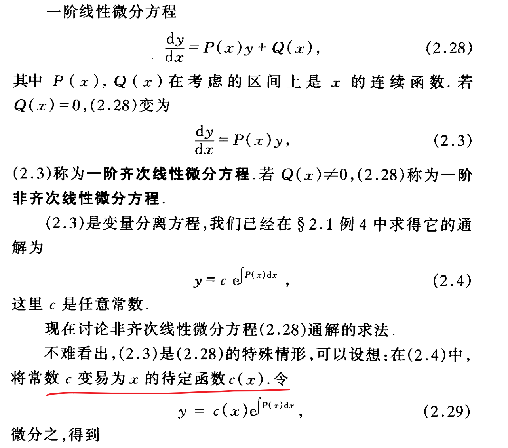

> ODE是讨论关于一个未知数的方程

## 齐次是什么
> ==理解齐次的关键==

## 在微分方程中的齐次方程

**线性微分方程的齐次性**：如果一个线性微分方程的所有项都是未知函数及其导数的线性组合，并且方程右侧等于零，那么这个方程就被称为齐次的。在微分方程中，特别是线性微分方程中，一个方程称为齐次的，是指方程右侧为零。==这里的“齐次”与多项式的幂次无关，而是指未知函数及其导数的线性组合是否没有独立的非零项==。例如，线性二阶齐次微分方程 $$ y′′+p(x)y′+q(x)y=0 $$ 

> 这里说明下， y′′+p(x)y′+q(x)y\=g(x)为什么不是齐次的，
> g(x) 其中 g(x)是一个不依赖于 y 的函数
    
**一般微分方程的齐次性**：在非线性微分方程中，齐次性通常是指方程对于某种缩放是不变的。例如，一阶非线性微分方程 
$$
\frac{dy}{dx} = f\left(\frac{y}{x}\right) $$ 
是齐次的，因为它在 x 和 y 的缩放下保持不变。

## 微分方程分类
### 线性微分方程

1.  **结构**：线性微分方程是指那些未知函数及其导数只以线性方式出现的方程。这意味着方程中的任何项都不包含未知函数的幂、乘积或其他非线性组合。
    
2.  **形式**：一阶线性微分方程通常具有 $$\frac{dy}{dx} + p(x)y = q(x) $$ 的形式，其中 p(x)和 q(x) 是关于自变量 x 的已知函数。高阶线性微分方程则具有更复杂的形式，但所有项仍然保持对未知函数 y 及其导数的线性关系。
    
3.  **解的特性**：线性微分方程的解通常更易于找到，并且具有一些良好的性质，如叠加原理，即两个解的线性组合仍然是一个解。
    

### 一般微分方程

1.  **结构**：一般微分方程包括所有类型的微分方程，无论是线性的还是非线性的。非线性微分方程是这一类别中的一个重要子集。
    
2.  **形式**：一般微分方程可能包含未知函数的幂、乘积、复合函数等非线性项。例如，一个非线性方程可以有这样的形式$$ \frac{dy}{dx} = y^2 + x$$  。
    
3.  **解的特性**：一般微分方程，特别是非线性微分方程，通常更难解析求解。它们的解可能表现出更复杂和多样的行为，如周期解、混沌或依赖于初始条件的多解性。

## 一阶微分方程的解法
### 齐次微分方程：分离变量法
分离变量法指的是 $ \frac{dy}{dx} = f(\frac{y}{x}) $

### 非齐次微分方程：常数变易法
$$
\frac{dy}{dx} + P(x)y = Q(x)
$$
- 本质也是分离变量法，其本质是使用齐次特性解出 $\frac{dy}{dx}  y$ 最后非齐次中只剩关于x的函数 Q(x)

> **这里有点迷糊**： 为什么把C看作x特定函数

### 恰当微分方程
- 恰当微分方程的核心是左端恰好是个某个函数的全微分$du(x,y)$，问题就变成求$u(x,y)$
- 求解关键是凑成全微分项 **$ \frac{\partial{M}}{dx} = \frac{\partial{N}}{dy}  $**
- 对偏微分积分求出,非偏微分的元的函数$g(y)$
- 实际解题中多以经验记住常见二元微分形式
$$
\begin{align*}
ydx + xdy &= d(xy), \\
\frac{ydx - xdy}{y^2} &= d\left(\frac{x}{y}\right), \\
\frac{-ydx + xdy}{x^2} &= d\left(\frac{y}{x}\right), \\
\frac{ydx - xdy}{xy} &= d(\ln |x| - \ln |y|), \\
\frac{ydx - xdy}{x^2 + y^2} &= d(\arctan\frac{x}{y}), \\
\frac{ydx - xdy}{x^2 - y^2} &= \frac{1}{2}d\left(\ln |\frac{x-y}{x+y}|\right).
\end{align*}
$$
### 积分因子转恰当方程
在常微分方程中，积分因子是一种用于将非恰当微分方程转换为恰当微分方程的方法。这个概念通常应用于形如 $M(x,y)dx+N(x,y)dy=0 $的一阶微分方程。如果这个方程不是恰当的（也就是说，$ \frac{\partial M}{\partial y} \neq \frac{\partial N}{\partial x} $，我们不能直接找到一个势函数 $F(x,y) $ 使得$ dF=Mdx+Ndy $。在这种情况下，积分因子可以帮助我们修改方程，使其成为恰当的。
积分因子是一个函数 $ \mu(x, y) $，它的选择取决于 $ M(x,y) 和 N(x,y) $。当我们用这个积分因子乘以方程的两边时，我们希望得到：
$$
\mu M dx + \mu N dy = dG
$$
其中 $G(x,y)$ 是一个新的势函数。在最佳情况下，乘以积分因子后，$\mu M$ 关于 yyy 的偏导数会等于 $\mu N$ 关于 x 的偏导数：
$$
\frac{\partial (\mu M)}{\partial y} = \frac{\partial (\mu N)}{\partial x}
$$
### 一阶微分方程参数表示形式
**显性、隐式**

